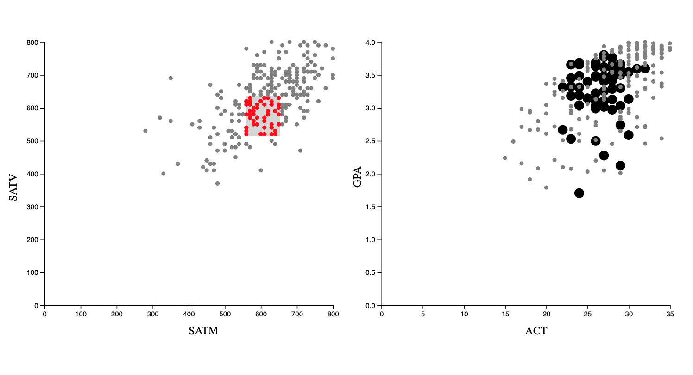
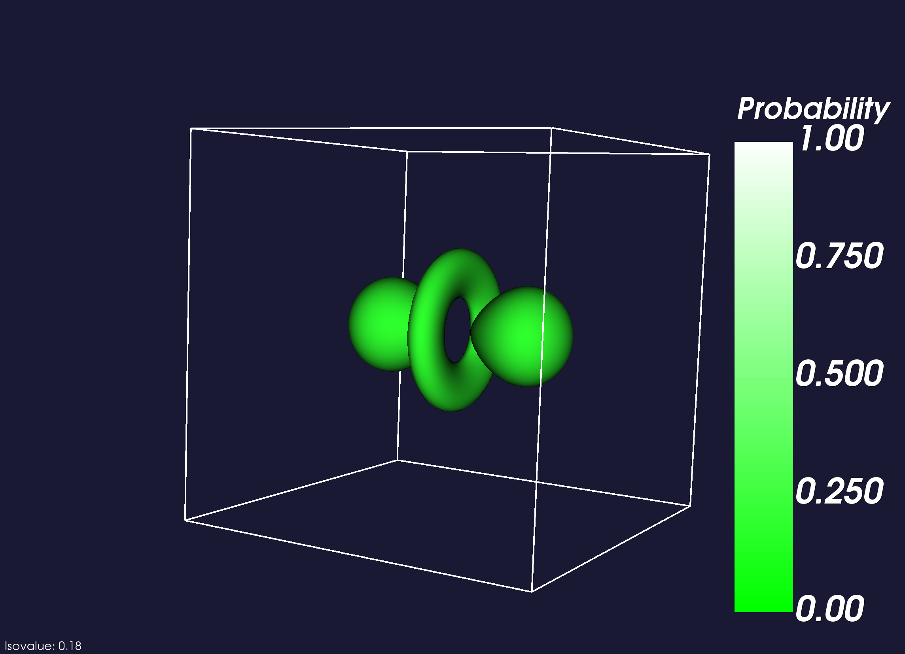

## d3.js linked view
##### [(demo)](https://sambeebe.github.io/d3-linked-view/) | [(code)](https://github.com/sambeebe/d3-linked-view/)

Interactive visualization of an example dataset made in d3.js. User can highlight explore connections.

## VTK Isosurface Rendering (Python)
##### [(code)](http://github.com/sambeebe/isosurface-and-volume-rendering "Example")
Created a visulalization of a probability density function for a hydrogen atom.

