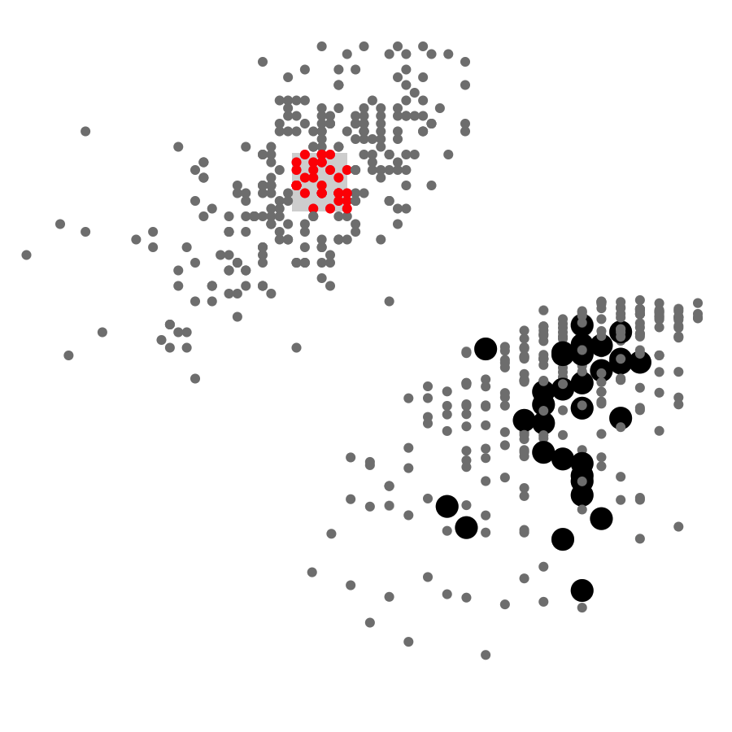

## d3.js linked view
##### [(demo)](https://sambeebe.github.io/d3-linked-view/) | [(code)](https://github.com/sambeebe/d3-linked-view/)

Interactive visualization of an example dataset made in d3.js. User can highlight explore connections.

## VTK experiments (Python)
VTK project that creates an isosurface using marching cubes.
Below is a visulalization of a probability density function for a hydrogen atom.

##### [(code)](http://github.com/sambeebe/isosurface-and-volume-rendering "Example")

<iframe src="https://streamable.com/s/vfyjq/nczo" frameborder="0" width="100%" height="100%" allowfullscreen style="width: 100%; height: 100%; position: absolute;"></iframe>

