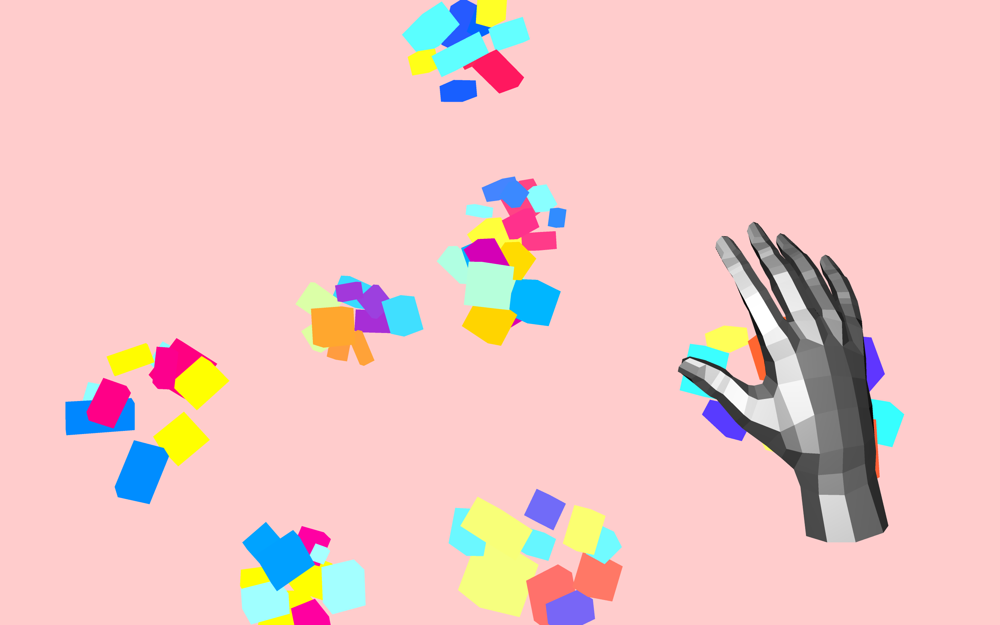
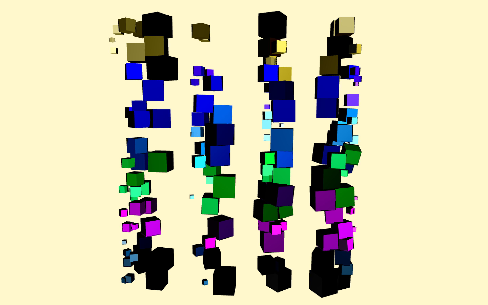

Abacus (or “handchimes”) is a rigid body simulation and digital instrument created with
Max/MSP. Collisions of rigid bodies are guided by a LeapMotion tracking device to create
sound. Audio is then routed through Ableton.

