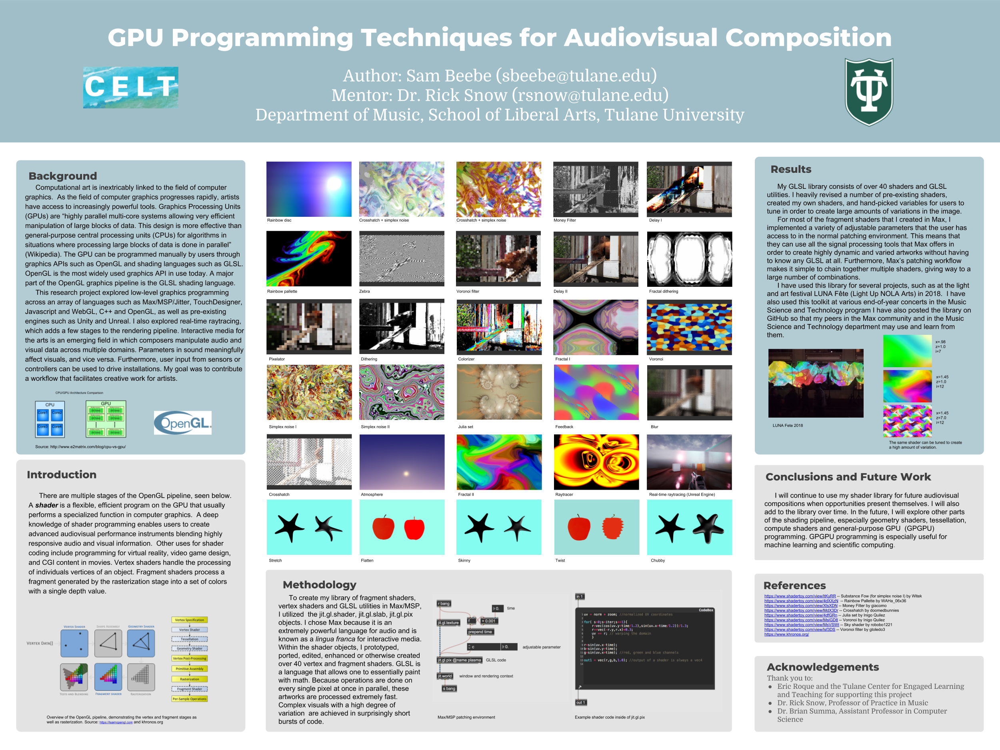

## Jitter shaders
##### Project "GPU Programming Techniques for Audiovisal Composition" that I completed in 2018 as part of my CELT Award for Faculty Mentored Undergraduate Research. Please note that these are mostly ports and a few of the sources are missing - I apologize.

<iframe width="650" height="390" src="https://www.youtube.com/embed/qofgslJtRsY" frameborder="0" allow="accelerometer; encrypted-media; gyroscope; picture-in-picture" allowfullscreen></iframe>

