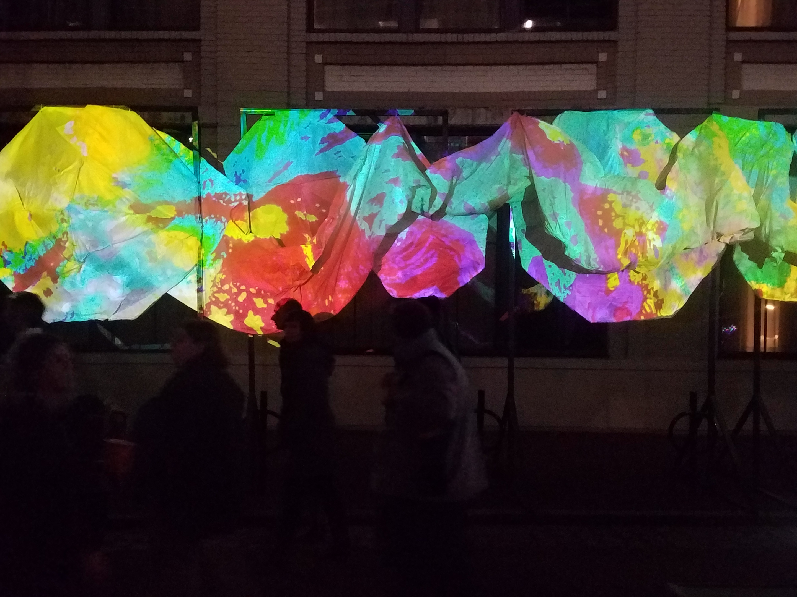
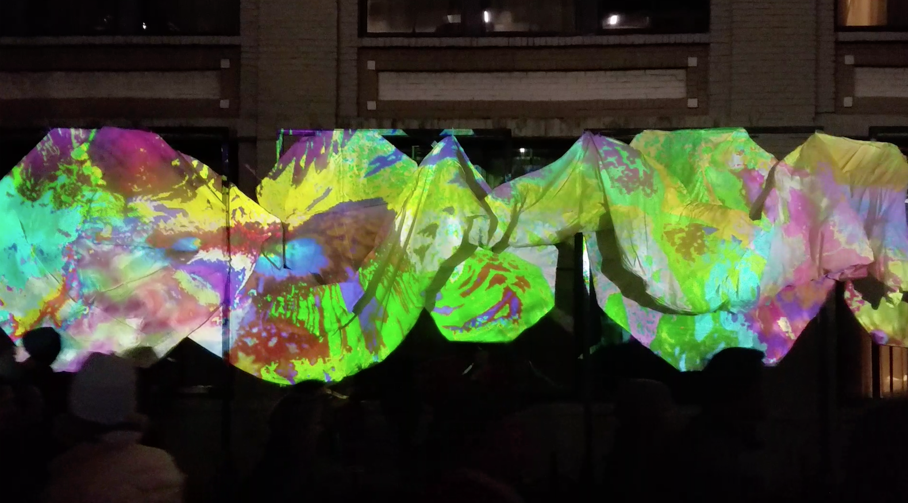

Art installation at LUNA (Light Up NOLA Arts) Fête in New Orleans, LA. Collaboration with the Music and Dance departments at Tulane. This project combined projection mapping, graphics programming and interactive digital instruments. We used a Kinect camera to allow interaction from festival attendees.

