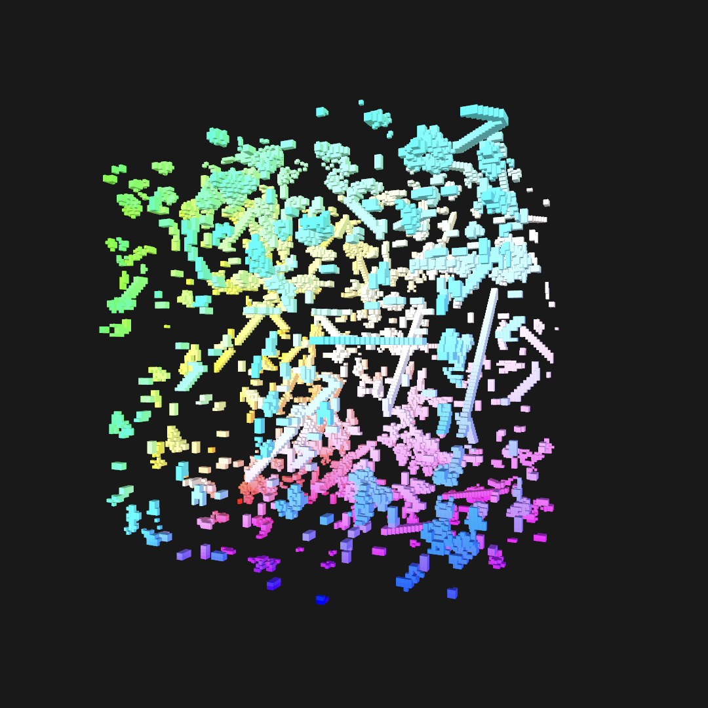

## Metal Creative Coding (Metal/Swift)
#### [code](http://github.com/sambeebe/CreativeCodingMetal "code")
Metal compute shaders to simulate 2D and 3D cellular automata, diffusion-limited aggregation and
flocking, with ongoing plans for further additions

