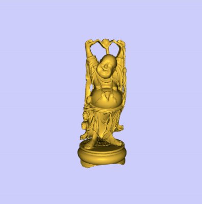
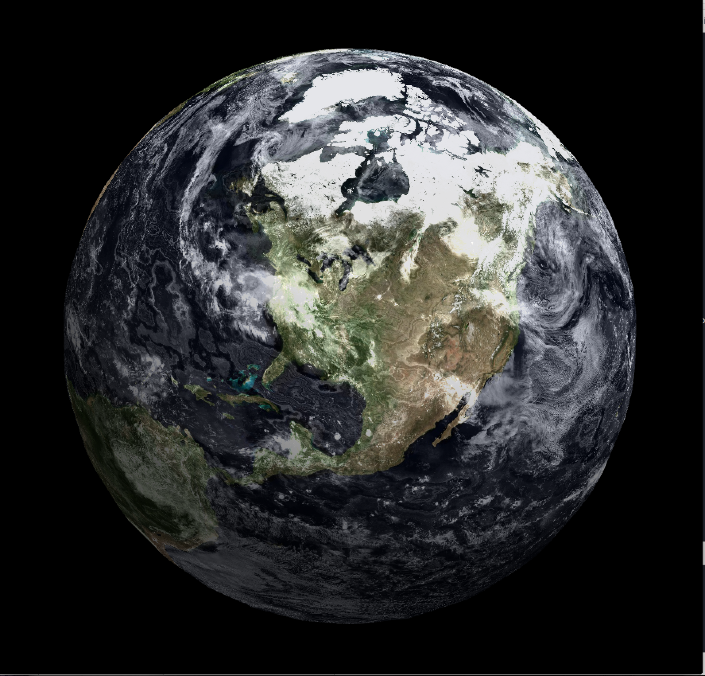

C++ programs

# ModelLoader-OpenGL

● Click dragging the mouse rotates the model via quaternion trackball

● Shift-drag zooms in on the model

● Alt-drag translates the object

View the [code](http://github.com/sambeebe/ModelLoader-OpenGL "Example") on GitHub.

# earth

Textured a model and created a lighting animation using fragment shaders.

View the [code](http://github.com/sambeebe/Earth-OpenGL "Example") on GitHub.
