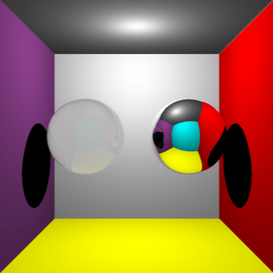

## Raytracer (C++)
#### [code](http://github.com/sambeebe/whitted-style-raytracer "code")
A simple Whitted-style raytracer. Implemented SSAA (supersampling anti-aliasing) by [jittering](https://en.wikipedia.org/wiki/Supersampling#Jittered "Jittered") (random sub-pixel sampling).

## OpenGL Model Loader (C++)
#### [code](http://github.com/sambeebe/ModelLoader-OpenGL "Example")
C++ program that loads a model into OpenGL. Implemented Phong shading

## OpenGL Earth Animation (C++)
#### [code](http://github.com/sambeebe/Earth-OpenGL "Example")
Textured a model and created a lighting animation using fragment shaders

