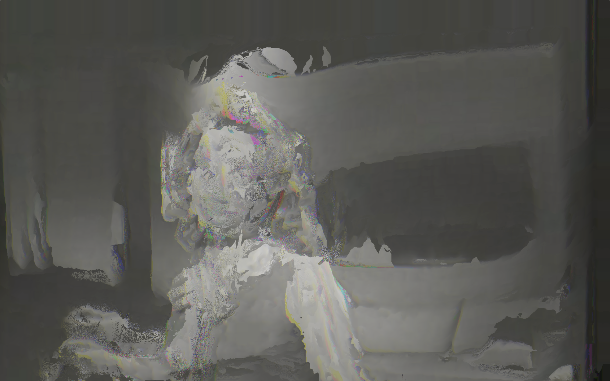

This is a collection of shader programs that I've implemented using three.js. A shader is a program executed on the GPU that performs a specialized function in computer graphics. GPUs allow for  efficient, highly-parallel calculations.

## Reaction diffusion
#### [demo](https://sambeebe.github.io/reaction-diffusion-threejs/) | [code](https://github.com/sambeebe/reaction-diffusion-threejs/)

## Glitch feedback
#### [demo](https://sambeebe.github.io/glitch-shader-threejs/) | [code](https://github.com/sambeebe/glitch-shader-threejs/)

