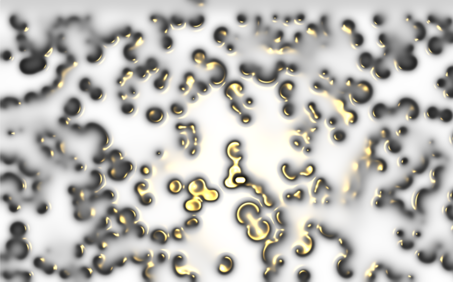

## Reaction diffusion
#### [demo](https://sambeebe.github.io/reaction-diffusion-threejs/) | [code](https://github.com/sambeebe/reaction-diffusion-threejs/)

# [(Glitch shader demo)](https://sambeebe.github.io/glitch-shader-threejs/).
## Glitch feedback
#### [demo](https://sambeebe.github.io/glitch-shader-threejs/)

