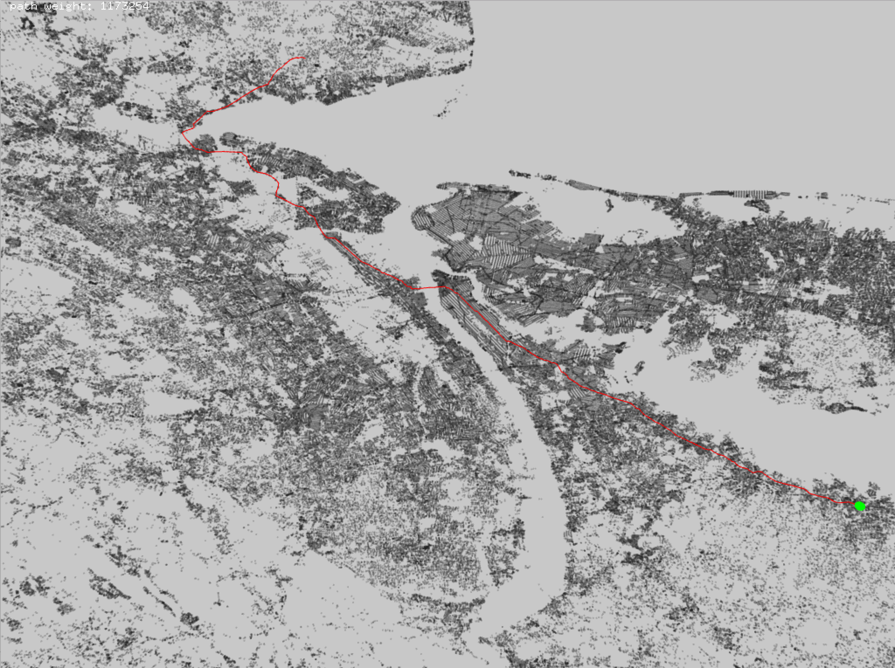

Computes and visualizes the shortest path on a graph. Points are given as latitude and longitude and rendered as points, and Dijikstra's algorithm is used to compute the shortest path.

View the [code](http://github.com/sambeebe/ofxShortestPath " ") on GitHub.
