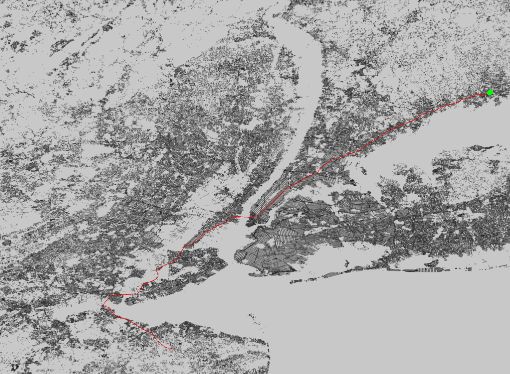

Computes and visualizes the shortest path on a graph contains real world road distances in New York City and the surrounding area. Dijikstra's algorithm is used to compute the shortest path.

View the [code](http://github.com/sambeebe/ofxShortestPath " ") on GitHub.
